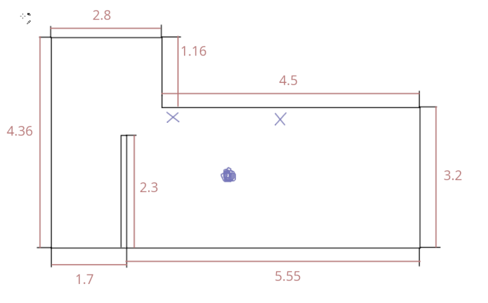
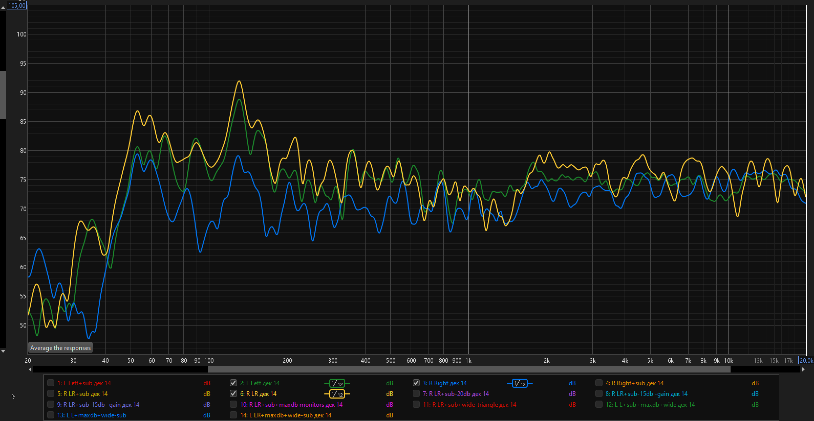
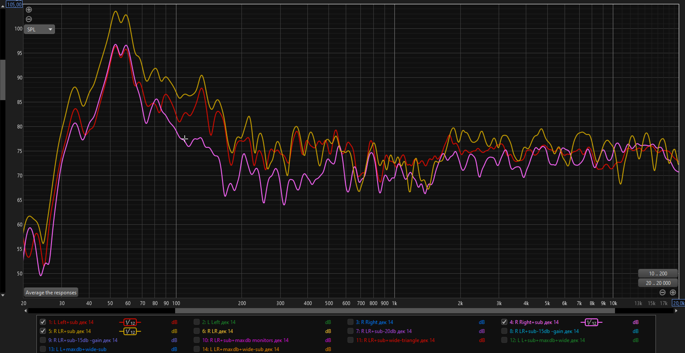
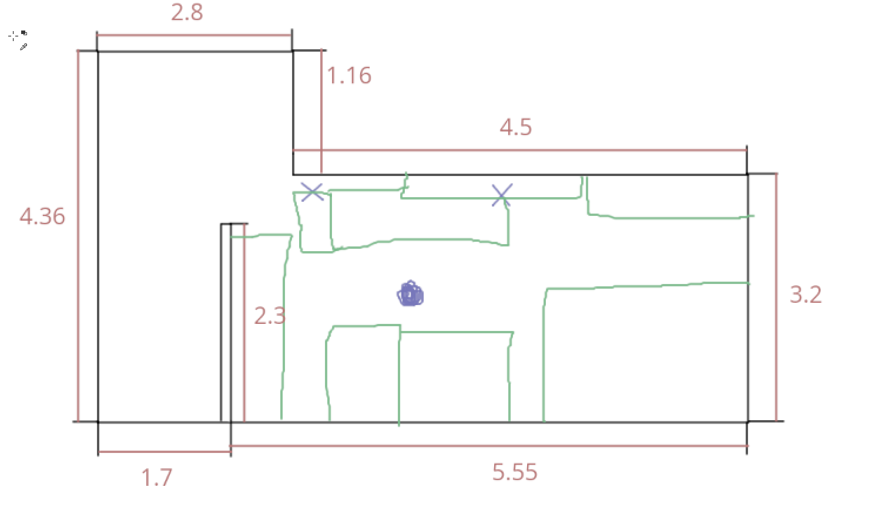
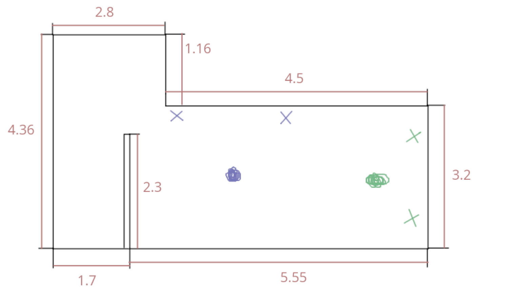

# Почему лучше для сведения лучше выбрать наушники, а не мониторы
Многие на начальном этапе задаются вопросом "что лучше купить мониторы или наушники?".
Возможно кто-то думает что этот вопрос очевиден, ведь сводить в наушниках это фу.
Я хочу рассказать почему наушники все таки предпочтительнее для начинающих.
Если кратко, то наушники это дешевле. Причем дешевле в нескольких смыслах. От бюджета, до потраченного времени.

Если представить гипотетическую ситуацию, что вы перед выбором:
* наушники за 100к рублей
* пара мониторов за 100к рублей

Оба варианта попадают под правило "хочешь профессиональную железку, она должна быть не меньше тысячи долларов".
Люди говорят, что мониторы это правильнее. Я могу сказать вам, что цена у этих двух вариантов не одинаковая и
дальше я расскажу почему.

## Вы будете плохо сводить на мониторах
Это может быть неправдой, если вы уже имеете комнату, которую вы подготовили для сведения. Тогда в этом выборе
можно(и стоит) выбрать мониторы.

Но если у вас ситуация как и у многих других, в том числе у меня, то всё так.

### Почему?
Потому что для мониторов вам надо заняться звуковых оформлением места где вы их будете использовать.
А это и деньги и куча времени. "Ну что такого, подумаешь бас гудит, ну буду сводить с учетом этого знания" скажете вы.
А я скажу что проблем у вас будет вагон и маленькая тележка. Миксы выши будут плохи, потому что вы будете многое слышать
неправильно.

Расскажу про проблемы со звуком в своей квартире.

Я использую мониторы krk rp6 g2 и сабвуфер krk 10s. Недавно ко мне приехал измерительный микрофон и я померил что я имею
в своей комнате. Я знал что у меня обязательно есть проблемы и так и оказалось. Например, я понял что сабвуфер мне как 
собаке пятая нога.

Дальше я расскажу о комнате и покажу замеры.

Комната у меня странной формы. На рисунке указаны размеры в метрах. Синие крестики это расположение мониторов. Синяя клякса
место где у меня голова. Пенек слева от головы это гипсокартонная перегородка.

Первая проблема с расстановкой. Я нарушил правила расстановки мониторов, нужно их ставить у короткой стены. Я бы рад, но
там жена и кровать уже стоят 🙂.

Далее - замеры, что я делал. Первый скриншот это замеры левого и правого мониторов и совместный замер.
Синее правый монитор, зеленое левый, желтое оба.

То что все три линии как будто бешеный сейсмограф нарисовал, но в целом такие замеры так и выглядят. Идеал это прямая линия, 
но на деле это всегда вот такая хреновина. Чем ровнее это всё тем лучше. Широкие и сильные перепады - плохо. Маленькие перепады
не так страшно.

Что мы видим? Первое, что у нас на 50 гц и на 120гц прям нормально так торчит. Ну вот как раз гудящий бас. Ну гудит и гудит,
скажете, даже хорошо, все любят бас. Ну если просто слушать, может так и есть, но мы то сводить хотим. 
Поэтому нам придется это гасить. Чтобы погасить такие частоты, надо накупить минеральной ваты, досок, наделать акустических
панелей и разобраться куда их расположить.

Микрофон кстати измерительный тоже надо будет купить. И разобраться в софте для замеров (REW называется). 

Но допустим вам плевать, тут на сцену выходит вторая проблема - замеры левого монитора, отличаются от замеров правого.
Чем это плохо? Тем что стерео будет не правильным. Например,  будет играть 120гц, в компе оно по-середине, мониторы дают
одинаковую громкость, а в точке прослушивания у левого монитора громкость будет выше, и мы получим перекос в стерео поле.

Причем какие-то частоты будут правильно играть, какие-то могут с перекосом. В целом можете на своих колонках поиграть 
разные синусы(60гц, 120гц, 1кгц и т.д) и послушать где они в стереополе. Схема такая. Играете все синусы на левой колонке.
Потом играете все синусы на правой колонке. Потом играете все синусы по центру. Если у вас все играло где надо, то возможно
проблем со стерео(фантомным центром) у вас на протяжении всех частот нет. У меня они есть.

Еще одна проблема, АЧХ у нас не ровная, где-то пики, где-то провалы. Проблемы с фантомным центром. Всё это в комплексе
может привести к тому, что вы будете неверно выстраивать баланс инструментов, будете эквализировать то, что не требует эквализации.
Будут проблемы с панаромированием. Проблемы с фантомным центром тоже могут влиять в плохую сторону на баланс.

Еще прикольнее если добавить саб

50 гц тогда просто

Все вышесказанное не значит, что вы не можете купить себе мониторы. Я только хочу донести, что просто купить мониторы
не достаточно. Их нужно правильно расположить, всё замерить и исправить всё что намерили. Если вы просто купите мониторы,
поставите их где удобно, то мониторы не покажут вам реальной картины. Вы будете плохо слышать микс, вы будете принимать
неверные решения и возможно сойдете с ума пытаясь понять что вы делаете не так.

### Но я хочу мониторы, как быть?
Разбирайтесь как акустически оформить помещение, как делать замеры, как правильно расставлять мониторы.

В моем случае, надо переставить в квартире всё. Зеленым нарисовал мебель и телевизор

Как видите места у меня практически нет. Все стоит как может. Зеленым нарисовал где по хорошему мне надо поставить 
мониторы

Ну 90% там тоже будет торчать 120 герц. Потому что размеры моей комнаты дают такие моды.

После перестановки всего мне придется еще туда-сюда мониторы попереставлять. А потом идти в строительный и делать 
басовые ловушки и акустические панели, чтобы забороть пики и провалы в замерах.

И это у меня еще достаточно большое помещение. Не каждое помещение можно скорректировать. Может просто не быть места для
размещения ловушек.

И я даже не касался того что есть отражения от стола, проблемы с реверберацией и т.д. т.п. С наушниками ничего этого не будет.
Как и баса 🙂. Но в остальном вы будете слышать более корректную картину. 

Если хотите позадротствовать, то вот вам ютуб канал https://www.youtube.com/@FlashRecordsStudios
Автор нумерует ролики, можете начинать с первого 🙂.
Обычно все говорят о сведении и плагинах, а он много рассказывает об акустике.

Это не попытка убедить вас покупать наушники. Я хочу донести что покупка мониторов это чуть больше чем купил и пользуешься.
Надо еще тюки с минватой поперетаскивать будет = )

